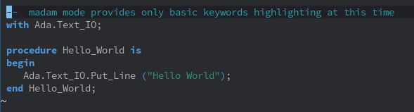

# madam

This is a work in progress. No automatic loading is supported yet, run `M-x
eval-buffer` to load it manually, then `M-x madam-mode` on any Ada source file
to try it.

Note that I don't know what I'm doing!
